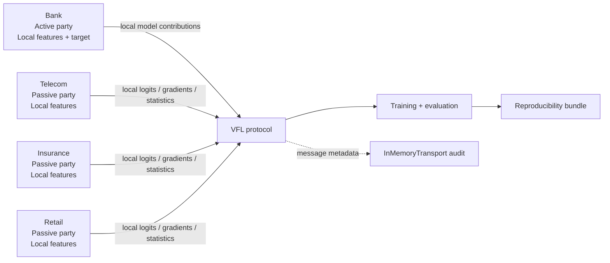

<h1 align="center">VertiMosaic</h1>

<p align="center">
  <b>Cross-Industry Vertical Federated Learning for Tabular Data</b>
</p>

<p align="center">
  A research framework for reproducible vertical federated learning across organizations that hold complementary attributes about overlapping entities while keeping raw feature tables local.
</p>

<p align="center">
  <a href="https://github.com/sauravsingla/VertiMosaic/actions/workflows/ci.yml"></a>
  <a href="https://github.com/sauravsingla/VertiMosaic/actions/workflows/security.yml"></a>
  <a href="https://github.com/sauravsingla/VertiMosaic/actions/workflows/package.yml"></a>
  
  <a href="LICENSE"></a>
</p>

VertiMosaic is an open-source research framework for **vertical federated learning (VFL)** on heterogeneous tabular data. It is designed for experiments in which different organizations own different feature columns for the same or overlapping entities and raw passive-party feature matrices are not pooled into the active party.

The framework emphasizes **scientific reproducibility, explicit privacy boundaries, source provenance, communication auditing, and efficient reference implementations**. It deliberately distinguishes raw-feature locality and pseudonymization from stronger cryptographic privacy guarantees.

### Highlights

- **True vertical partitioning:** Bank is the active party and owns the binary target; Telecom, Insurance, and Retail contribute complementary feature columns through party-local computations.
- **Reference algorithms:** first-principles NumPy/scikit-learn ecosystem with no GPU requirement.
- **Two VFL model families:** `VFLLogisticRegression` and `VFLHistGBDT`.
- **Cross-industry research benchmark:** externally grounded, semi-synthetic linkage across public source domains.
- **Optional genuinely linked benchmark:** authorized local IEEE-CIS transaction/identity files joined by exact `TransactionID` intersection.
- **Reproducible experiment bundles:** configuration, provenance, environment, metrics, predictions, communication metadata, hashes, seed, timestamps, and Git SHA.
- **Explicit threat model:** no claim of automatic PSI, MPC, homomorphic encryption, secure aggregation, collusion resistance, malicious-party security, or formal differential privacy.

## Architecture in Motion

<p align="center">
  
</p>

The animation reflects the current reference protocols. Raw feature matrices stay party-local. `VFLLogisticRegression` uses local logits and residual signals with party-local gradient computation, while `VFLHistGBDT` uses gradients, Hessians, local histogram candidates, aggregate candidate metadata, and party-local split routing. `InMemoryTransport` records communication metadata for the in-process research simulator; it is not a cryptographic transport layer.

## Table of Contents

- [Architecture in Motion](#architecture-in-motion)
- [Installation](#hammer_and_wrench-installation)
- [Quick Start](#rocket-quick-start)
- [Technical Components](#bricks-technical-components)
- [Framework Overview](#bulb-framework-overview)
- [Reference Algorithms](#gear-reference-algorithms)
- [Benchmark Modes](#test_tube-benchmark-modes)
- [Privacy Boundary](#lock-privacy-boundary)
- [External Data and Provenance](#card_file_box-external-data-and-provenance)
- [Evaluation and Reproducibility](#bar_chart-evaluation-and-reproducibility)
- [Verification](#white_check_mark-verification)
- [Documentation](#books-documentation)
- [Citation](#page_facing_up-citation)
- [License](#balance_scale-license)

## :hammer_and_wrench: Installation

VertiMosaic requires Python **3.11 or 3.12**.

```bash
git clone https://github.com/sauravsingla/VertiMosaic.git
cd VertiMosaic
python -m pip install --upgrade pip
python -m pip install -e .
```

For development and verification tooling:

```bash
python -m pip install -e ".[dev]"
```

## :rocket: Quick Start

```bash
vertimosaic --help
vertimosaic demo --rows 2000 --seed 42
```

The quick-start demo is a smoke experiment and uses **100 bootstrap replicates**. Normal research experiment and benchmark commands default to **1,000 bootstrap replicates**. Experiment commands create a standard reproducibility bundle under `runs/<run_id>/`.

### Common commands

```bash
vertimosaic datasets list
vertimosaic datasets describe bank
vertimosaic datasets verify
vertimosaic datasets download bank
vertimosaic datasets download-all
vertimosaic prepare-external
vertimosaic generate-synthetic
vertimosaic train --model logistic
vertimosaic train --model vfl-hist-gbdt
vertimosaic evaluate
vertimosaic ablation
vertimosaic contribution
vertimosaic overlap
vertimosaic dropout
vertimosaic drift
vertimosaic benchmark
vertimosaic report
vertimosaic external-demo --model vfl-hist-gbdt --seed 42
```

### Optional IEEE-CIS linked benchmark

IEEE-CIS files are **authorized local inputs only**. VertiMosaic does not download or redistribute these competition files, and ordinary CI does not depend on them.

Prepare local inputs:

```bash
vertimosaic prepare-ieee-cis \
  --transaction /path/to/train_transaction.csv \
  --identity /path/to/train_identity.csv
```

Run the genuinely linked two-party benchmark:

```bash
vertimosaic run-ieee-cis \
  --transaction /path/to/train_transaction.csv \
  --identity /path/to/train_identity.csv \
  --model logistic \
  --seed 42
```

This mode uses the exact `TransactionID` intersection, keeps `isFraud` with the active transaction party, fits preprocessing independently on each party's training rows, evaluates on an entity-level held-out test set, pseudonymizes exported test identifiers, records source-file SHA-256 checksums, and writes the same reproducibility bundle as other experiments. It is a **two-party linked sanity benchmark** and is not presented as a four-industry benchmark.

## :bricks: Technical Components

VertiMosaic is organized around a small set of research components:

- **Party objects:** hold local feature matrices and perform party-local preprocessing/computation.
- **Active party:** Bank owns the binary target and coordinates target-dependent training steps.
- **Passive parties:** Telecom, Insurance, and Retail own complementary feature columns.
- **Linkage layer:** builds aligned research populations while preserving the distinction between real source data and semi-synthetic cross-domain linkage.
- **VFL protocols:** logistic regression and histogram-gradient-boosting reference implementations.
- **Communication simulator:** `InMemoryTransport` records message metadata such as type, sender/receiver roles, shapes, scalar counts, and estimated bytes without retaining transmitted array values.
- **Evaluation layer:** entity-level splits, validation-only threshold selection, metrics, calibration, bootstrap confidence intervals, and paired bootstrap differences.
- **Reproducibility layer:** run manifests, hashes, environment/dependency versions, predictions, provenance, configuration, and Git state.

## :bulb: Framework Overview



VertiMosaic models **column-partitioned learning**. Federated model code requests local computations from party objects rather than concatenating passive raw matrices into the Bank. The in-memory transport provides a reproducible communication simulator and metadata audit; it is **not** a real network-isolation or cryptographic-security layer.

### Data representation

| Party | Private information represented |
|---|---|
| Bank | Financial/payment behaviour + target |
| Telecom | Communications/service behaviour |
| Insurance | Claims/risk behaviour |
| Retail | Purchase behaviour |

| Property | VertiMosaic |
|---|---|
| Federation type | Vertical Federated Learning |
| Raw feature tables pooled | No |
| GPU required | No |
| Graph ML required | No |
| External real-world datasets | Yes |
| Four source datasets contain the same actual people | No |
| Cross-industry linkage | Explicitly semi-synthetic |
| Reference implementation | NumPy/scikit-learn ecosystem |

### True vertical federated learning

Horizontal FL generally trains across different entities that share a similar feature schema. Vertical FL aligns the same or overlapping entities while parties own different feature columns. VertiMosaic implements the latter: passive-party raw feature matrices remain inside their party objects during federated training.

The four primary public sources do **not** describe the same real people. The four-industry benchmark is therefore an **externally grounded semi-synthetic cross-industry VFL benchmark**. In observed-target mode, linkage is target-blind. In distributed-signal mode, the target is generated only after linked profiles are formed.

## :gear: Reference Algorithms

### `VFLLogisticRegression`

A first-principles NumPy reference protocol. Each party computes local logits and local gradients over only its own features.

### `VFLHistGBDT`

A vertical histogram-gradient-boosting research implementation in which parties compute local candidate statistics and the owning party performs routing.

Centralized models exist only as **NON-FEDERATED BASELINES** for research comparison and are never relabelled as VFL.

## :test_tube: Benchmark Modes

- **`observed_target_external`** — Bank is the anchor population and uses the published observed default target; external profiles are linked target-blind.
- **`distributed_signal_external`** — real transformed source-domain features are linked first, then a clearly disclosed semi-synthetic target depends on all four parties.
- **`synthetic_scale`** — fully controlled scaling, overlap, dropout, drift, noise, and distributed-signal experiments.
- **`ieee_cis_linked`** — optional genuinely linked two-party VFL benchmark using authorized local IEEE-CIS transaction and identity files joined by `TransactionID`; restricted source files are never downloaded, committed, or redistributed by VertiMosaic.

## :lock: Privacy Boundary

The default simulator provides:

- raw-feature locality;
- party-local computation and preprocessing;
- explicit protocol boundaries;
- metadata-only communication auditing; and
- research pseudonymization.

It is **not cryptographically secure VFL** and does not automatically provide PSI, MPC, homomorphic encryption, secure aggregation, collusion resistance, malicious-party security, or formal differential privacy.

Gradients, Hessians, local logits, residuals, entity membership, routing information, and derived split statistics may leak information. See [`docs/threat_model.md`](docs/threat_model.md) and [`docs/privacy_boundaries.md`](docs/privacy_boundaries.md).

## :card_file_box: External Data and Provenance

VertiMosaic grounds its four-industry external benchmark in the following public datasets:

| Industry / party | External dataset | Source ID | Role in VertiMosaic |
|---|---|---:|---|
| **Bank** | UCI **Default of Credit Card Clients** | UCI **350** | Financial/payment behaviour and the observed default target used by the active party |
| **Telecom** | UCI **Iranian Churn** | UCI **563** | Telecom, customer-service, usage and churn-related features |
| **Insurance** | OpenML **`freMTPL2freq`** + **`freMTPL2sev`** | **41214** + **41215** | Motor-insurance claim frequency, severity and risk-related features |
| **Retail** | UCI **Online Retail** | UCI **352** | Transaction and purchase behaviour, aggregated to customer level |

Conceptually, the benchmark creates an aligned research profile across the four parties:

```text
Bank customer
    ↕
Telecom profile
    ↕
Insurance profile
    ↕
Retail profile
```

**Important:** these four public datasets do **not** describe the same real people. VertiMosaic preprocesses them independently and connects the four industry profiles only through an **explicitly semi-synthetic, target-blind linkage mechanism** for the cross-industry benchmark. The resulting linked profile is therefore a research construction, not a claim that the original Bank, Telecom, Insurance, and Retail records belong to the same real customers.

The **Bank** dataset acts as the anchor population in `observed_target_external` mode and provides the published observed default target. In `distributed_signal_external` mode, transformed source-domain features are linked first and the semi-synthetic target is generated only after linked profiles are formed.

The **Retail** source is aggregated to customer level using an explicit source-time feature cutoff before cross-domain linkage, so post-cutoff transactions are excluded from the benchmark snapshot.

The optional **IEEE-CIS linked benchmark** is separate from the four-industry benchmark. It uses authorized local IEEE-CIS transaction and identity files joined through the exact `TransactionID` intersection and serves as a genuinely linked two-party sanity benchmark; VertiMosaic does not download or redistribute those competition files.

Dataset licensing remains separate from the Apache-2.0 source-code license; see [`DATA_LICENSES.md`](DATA_LICENSES.md). `vertimosaic datasets verify` checks static UCI attribution fields and queries OpenML's official JSON metadata API for the two insurance licenses. Verification fails conservatively when required provider license metadata cannot be obtained.

Each retrieved source capture records a SHA-256 content checksum before transformation, sampling, or temporal cutoff as applicable, plus raw/processed row counts and per-source license metadata. Processed feature artifacts have a separately scoped SHA-256 checksum; source-capture hashes are not presented as provider-published file checksums.

## :bar_chart: Evaluation and Reproducibility

Entity-level splits default to **70% train / 15% validation / 15% test**. Threshold selection uses validation data only.

Test evaluation supports:

- ROC-AUC and PR-AUC
- precision, recall, F1, and balanced accuracy
- log loss and Brier score
- expected calibration error (ECE)
- confusion counts
- deterministic bootstrap intervals
- paired bootstrap differences

Normal research runs use **1,000 deterministic bootstrap replicates** where practical; smoke CI uses **100**. No benchmark conclusion is hard-coded. Negative and uncertain findings are retained. Communication quantities are **simulated payload estimates**, not measured network traffic or latency.

Every experiment run bundle records `config.yaml`, dataset/linkage provenance, environment and dependency versions, measured metrics, predictions, training history, communication metadata, feature provenance, artifact hashes, configuration hash, timestamps, seed, and Git SHA under `runs/<run_id>/`.

## :white_check_mark: Verification

```bash
ruff check .
ruff format --check .
mypy src/vertimosaic
pytest -q --cov=vertimosaic --cov-report=term-missing
bandit -r src
pip-audit
vertimosaic demo --rows 2000 --seed 42
python scripts/reproduce_paper.py --smoke
python -m build
twine check dist/*
```

Protocol-critical modules target at least **90% coverage**; coverage is not inflated merely to chase 100%.

## :books: Documentation

Detailed design and research notes are available in:

- [`docs/architecture.md`](docs/architecture.md)
- [`docs/protocol.md`](docs/protocol.md)
- [`docs/vertical_vs_horizontal_fl.md`](docs/vertical_vs_horizontal_fl.md)
- [`docs/datasets.md`](docs/datasets.md)
- [`docs/linkage.md`](docs/linkage.md)
- [`docs/privacy_boundaries.md`](docs/privacy_boundaries.md)
- [`docs/threat_model.md`](docs/threat_model.md)
- [`docs/reproducibility.md`](docs/reproducibility.md)
- [`docs/limitations.md`](docs/limitations.md)
- [`paper/experiment_manifest.md`](paper/experiment_manifest.md)

## :page_facing_up: Citation

If you use VertiMosaic in research or development, please cite the software using the repository's [`CITATION.cff`](CITATION.cff):

```text
VertiMosaic
Saurav Singla
Version 0.1.0
Apache-2.0
https://github.com/sauravsingla/VertiMosaic
```

GitHub also exposes a **Cite this repository** action based on `CITATION.cff`.

## :balance_scale: License

VertiMosaic source code is licensed under the **Apache License 2.0**. Dataset licenses and provider terms remain separate; see [`DATA_LICENSES.md`](DATA_LICENSES.md).